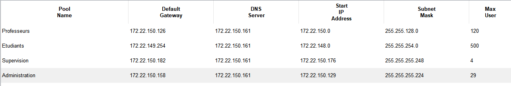
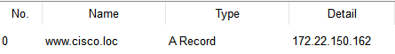

# Projet Réseau ICS

***Emile METRAL ICS***

**L'ensemble des configurations des équipements réseau sont sur mon github : https://github.com/EBMBA/ICS3_Network_Project**

- [Projet Réseau ICS](#projet-réseau-ics)
- [Plan d'adressage IPv4](#plan-dadressage-ipv4)
  - [Justification](#justification)
    - [VLAN 50](#vlan-50)
      - [Nombre de bits nécessaire :](#nombre-de-bits-nécessaire-)
      - [Calcul du masque :](#calcul-du-masque-)
      - [Adresse réseau :](#adresse-réseau-)
      - [Adresse de diffusion :](#adresse-de-diffusion-)
    - [VLAN 40](#vlan-40)
      - [Nombre de bits nécessaire :](#nombre-de-bits-nécessaire--1)
      - [Calcul du masque :](#calcul-du-masque--1)
      - [Adresse réseau :](#adresse-réseau--1)
      - [Adresse de diffusion :](#adresse-de-diffusion--1)
    - [VLAN 30](#vlan-30)
      - [Nombre de bits nécessaire :](#nombre-de-bits-nécessaire--2)
      - [Calcul du masque :](#calcul-du-masque--2)
      - [Adresse réseau :](#adresse-réseau--2)
      - [Adresse de diffusion :](#adresse-de-diffusion--2)
    - [VLAN 20](#vlan-20)
      - [Nombre de bits nécessaire :](#nombre-de-bits-nécessaire--3)
      - [Calcul du masque :](#calcul-du-masque--3)
      - [Adresse réseau :](#adresse-réseau--3)
      - [Adresse de diffusion :](#adresse-de-diffusion--3)
    - [VLAN 10](#vlan-10)
      - [Nombre de bits nécessaire :](#nombre-de-bits-nécessaire--4)
      - [Calcul du masque :](#calcul-du-masque--4)
      - [Adresse réseau :](#adresse-réseau--4)
      - [Adresse de diffusion :](#adresse-de-diffusion--4)
- [Configuration VLAN des switchs](#configuration-vlan-des-switchs)
  - [Réseau 1](#réseau-1)
    - [Switch 1 : R1SW1](#switch-1--r1sw1)
    - [Switch 2 : R1SW2](#switch-2--r1sw2)
  - [Réseau 2](#réseau-2)
    - [Switch 1 : R2SW1](#switch-1--r2sw1)
    - [Switch 2 : R2SW2](#switch-2--r2sw2)
  - [Réseau 3](#réseau-3)
    - [Switch 1 : R3SW1](#switch-1--r3sw1)
- [Configuration de routage](#configuration-de-routage)
  - [R1](#r1)
  - [R2](#r2)
  - [R3](#r3)
  - [R4](#r4)
- [Configuration DHCP](#configuration-dhcp)
- [Configuration DNS](#configuration-dns)


# Plan d'adressage IPv4
| Connection | Nombre d'hôte | Pas | Masque (/) | Masque décimal | Adresse réseau | Adresse de diffusion |
|------------|---------------|-----|------------|----------------|----------------|----------------------|
| R1-R2      |   2           | 2^2 | 32 -2 = /30| 255.255.255.252| 172.22.150.184 | 172.22.150.187       |
| R2-R3      |   2           | 2^2 | 32 -2 = /30| 255.255.255.252| 172.22.150.188 | 172.22.150.191       |
| R1-R3      |   2           | 2^2 | 32 -2 = /30| 255.255.255.252| 172.22.150.192 | 172.22.150.195       |

Réseau : 172.22.148.0/22

255.255.1111 1100.0 ==> 255.255.252.0

| VLAN | Nombre d'hôte | Pas | Masque (/) | Masque décimal | Adresse réseau | Adresse de diffusion |
|------|---------------|-----|------------|----------------|----------------|----------------------|
| 50   |   500         | 2^9 | 32 -9 = /23| 255.255.254.0  | 172.22.148.0   | 172.22.149.255       |
| 40   |   120         | 2^7 | 32 -7 = /25| 255.255.255.128| 172.22.150.0   | 172.22.150.127       |
| 30   |   30          | 2^5 | 32 -5 = /27| 255.255.255.224| 172.22.150.128 | 172.22.150.159       |
| 20   |   12          | 2^4 | 32 -4 = /28| 255.255.255.240| 172.22.150.160 | 172.22.150.175       |
| 10   |   4           | 2^3 | 32 -3 = /29| 255.255.255.248| 172.22.150.176 | 172.22.150.183       |

Serveur DNS : 172.22.150.161

Serveur Web : 172.22.150.162

Serveur DHCP : 172.22.150.163

Les adresses IPv4 des passerelles sont les dernières IPv4 utilisables dans chaque réseaux.
## Justification
### VLAN 50 

Besoin : 500 adresses IPv4.

#### Nombre de bits nécessaire :

`2^?-2 >= 500`

`2^9-2 = 510 adresses disponibles`

#### Calcul du masque :
`32-9 = 23`

`255.255.1111 1110.0 ==> 255.255.254.0`

#### Adresse réseau :
`172.22.148.0`

#### Adresse de diffusion :
`172.22.1001 010|1.1111 1111 ==> 172.22.149.255`

### VLAN 40 

Besoin : 120 adresses IPv4.

#### Nombre de bits nécessaire :

`2^?-2 >= 120`

`2^7-2 = 126 adresses disponibles`

#### Calcul du masque :
`32-7 = 25`

`255.255.1111 1111.1000 0000 ==> 255.255.255.128`

#### Adresse réseau :
`172.22.150.0`

#### Adresse de diffusion :
`172.22.1001 0110.0|111 1111 ==> 172.22.150.127`

### VLAN 30 

Besoin : 30 adresses IPv4.

#### Nombre de bits nécessaire :

`2^?-2 >= 30`

`2^5-2 = 30 adresses disponibles`

#### Calcul du masque :
`32-5 = 27`

`255.255.1111 1111.1110 0000 ==> 255.255.255.224`

#### Adresse réseau :
`172.22.150.128`

#### Adresse de diffusion :
`172.22.1001 0110.100|1 1111 ==> 172.22.150.159`

### VLAN 20 

Besoin : 12 adresses IPv4.

#### Nombre de bits nécessaire :

`2^?-2 >= 12`

`2^4-2 = 14 adresses disponibles`

#### Calcul du masque :
`32-4 = 28`

`255.255.1111 1111.1111 0000 ==> 255.255.255.240`

#### Adresse réseau :
`172.22.150.160`

#### Adresse de diffusion :
`172.22.1001 0110.1010| 1111 ==> 172.22.150.175`

### VLAN 10 

Besoin : 4 adresses IPv4.

#### Nombre de bits nécessaire :

`2^?-2 >= 4`

`2^3-2 = 6 adresses disponibles`

#### Calcul du masque :
`32-3 = 29`

`255.255.1111 1111.1111 1000 ==> 255.255.255.248`

#### Adresse réseau :
`172.22.150.176`

#### Adresse de diffusion :
`172.22.1001 0110.1011 0|111 ==> 172.22.150.183`

# Configuration VLAN des switchs 

Les ports en gras sont en mode trunk. 
## Réseau 1
### Switch 1 : R1SW1
| VLAN | Nom         | Ports       | 
|------|-------------|------------|
| 40   |Professeurs  | Fa0/4, F0/2, **F0/1**|
| 50   | Etudiants   | Fa0/3, F0/2, **F0/1**| 

### Switch 2 : R1SW2
| VLAN | Nom         | Ports       | 
|------|-------------|------------|
| 40   |Professeurs  | Fa0/3, **F0/1**|
| 50   | Etudiants   | Fa0/2, **F0/1**| 

## Réseau 2
### Switch 1 : R2SW1
| VLAN | Nom         | Ports      | 
|------|-------------|------------|
| 20   |Serveurs  | Fa0/1, F0/3, **F0/2**|
| 30   | Administration   | Fa0/4, **F0/2**| 

### Switch 2 : R2SW2
| VLAN | Nom         | Ports       | 
|------|-------------|------------|
| 20   |Serveurs  | Fa0/3, F0/5, **F0/2**|
| 30   | Administration   | Fa0/4, F0/1, **F0/2**| 

## Réseau 3
### Switch 1 : R3SW1
| VLAN | Nom         | Ports       | 
|------|-------------|------------|
| 10   |Supervision  | Fa0/1, **F0/2**|


# Configuration de routage

## R1
```C
     172.22.0.0/16 is variably subnetted, 6 subnets, 5 masks
C       172.22.148.0/23 is directly connected, FastEthernet2/0.50
C       172.22.150.0/25 is directly connected, FastEthernet2/0.40
S       172.22.150.128/27 [1/0] via 172.22.150.186
S       172.22.150.160/28 [1/0] via 172.22.150.186
C       172.22.150.184/30 is directly connected, Serial0/0
C       172.22.150.192/30 is directly connected, Serial1/0
```

## R2
```C
     1.0.0.0/30 is subnetted, 1 subnets
C       1.1.1.0 is directly connected, Serial7/0
     172.22.0.0/16 is variably subnetted, 7 subnets, 6 masks
S       172.22.148.0/23 [1/0] via 172.22.150.185
S       172.22.150.0/25 [1/0] via 172.22.150.185
C       172.22.150.128/27 is directly connected, FastEthernet3/0
C       172.22.150.160/28 is directly connected, FastEthernet2/0
S       172.22.150.176/29 [1/0] via 172.22.150.190
C       172.22.150.184/30 is directly connected, Serial0/0
C       172.22.150.188/30 is directly connected, Serial1/0
```

## R3
```C
     172.22.0.0/16 is variably subnetted, 7 subnets, 6 masks
S       172.22.148.0/23 [1/0] via 172.22.150.193
S       172.22.150.0/25 [1/0] via 172.22.150.193
S       172.22.150.128/27 [1/0] via 172.22.150.189
S       172.22.150.160/28 [1/0] via 172.22.150.189
C       172.22.150.176/29 is directly connected, FastEthernet2/0.10
C       172.22.150.188/30 is directly connected, Serial1/0
C       172.22.150.192/30 is directly connected, Serial0/0
```

## R4
```C
     1.0.0.0/30 is subnetted, 1 subnets
C       1.1.1.0 is directly connected, Serial2/0
     192.168.0.0/30 is subnetted, 1 subnets
C       192.168.0.0 is directly connected, FastEthernet0/0
S*   0.0.0.0/0 [1/0] via 1.1.1.2
```

# Configuration DHCP

 

# Configuration DNS

